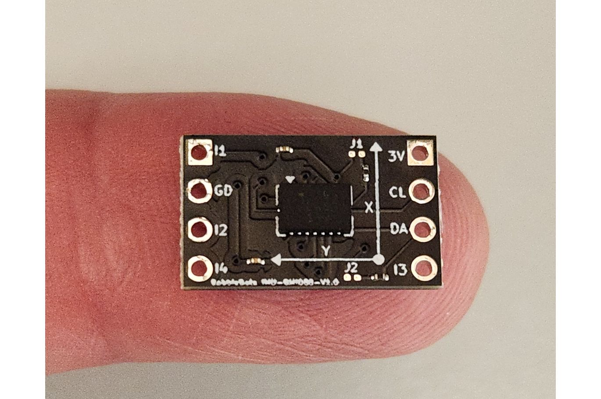
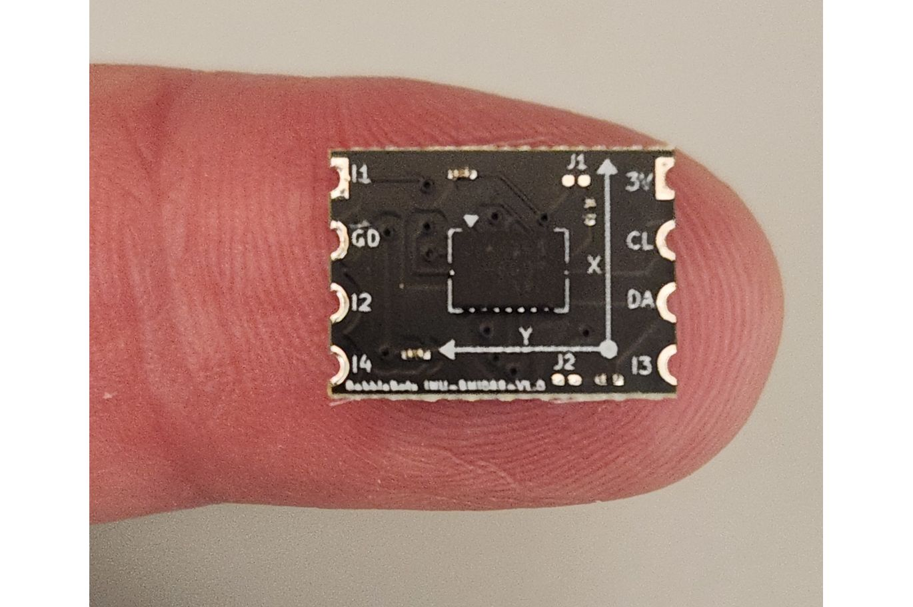

# BMI088 I^2 Breakout
Tiny I2C breakout board for the Bosch BMI088 Inertial Measurement Unit.  Available at tindie.com in 
[standard through-hole](https://www.tindie.com/products/bobbiebots/bmi088-i2c-breakout/) and 
[castellated](https://www.tindie.com/products/bobbiebots/bmi088-i2c-breakout-castellated-pin-version/) versions.

Arduino library [here](https://github.com/simondlevy/bmi088-arduino).

Based on https://github.com/AeroStrike/BMI088-Breakout-Board.
